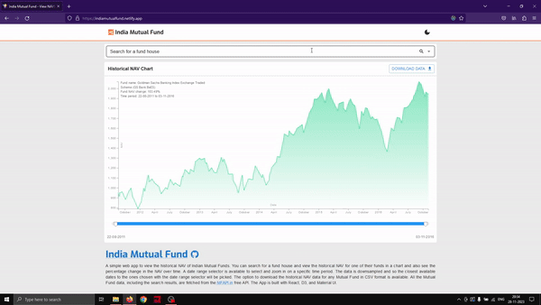

# Investment Perception and Selection Behavior Towards Mutual Funds

## Project Description
This platform is designed to help users understand mutual funds and make informed investment decisions. It provides detailed information about mutual fund structure, historical performance, risk characteristics, and the factors that influence fund selection.

The platform supports role-based usage so that different stakeholders can collaborate effectively:

### 1) Admin
- Manage platform configuration, users, and access permissions.
- Monitor user activities and engagement.
- Review and publish content updates.
- Oversee data quality, moderation, and platform governance.

### 2) Investor
- Explore and search mutual funds.
- Compare multiple funds across returns, volatility, and risk.
- View historical NAV trends with time filters.
- Track shortlisted/selected funds and download data for analysis.
- Use educational insights to choose funds aligned with goals and risk appetite.

### 3) Financial Advisor
- Provide personalized guidance for fund selection.
- Create educational content on asset allocation, diversification, and risk.
- Share model portfolios and strategy notes for different investor profiles.
- Assist users in interpreting performance and suitability.

### 4) Data Analyst
- Analyze investment behavior and fund preference trends.
- Update and validate fund performance datasets.
- Generate reports and insights for investors, advisors, and admins.
- Identify patterns in risk-return behavior and category movement.

## Core Platform Objectives
- Improve investor awareness of mutual fund structure, risk, and return behavior.
- Support evidence-based selection through transparent data and comparisons.
- Enable collaborative decision support through advisors and analysts.
- Provide reliable reporting for continuous platform improvement.

## Functional Scope
- Mutual fund discovery with intelligent search and filtering.
- Fund comparison across NAV, category, risk level, expense ratio, and horizon fit.
- Historical charting with date-range selection and trend interpretation.
- Educational content hub with advisor-authored guidance.
- Role-based dashboards for Admin, Investor, Advisor, and Analyst.
- Reporting module for trends, top-performing segments, and investor behavior.
- Notifications/alerts for important fund updates and market-relevant changes.

## Decision Factors Covered
- Risk tolerance and investment horizon.
- Fund category and objective alignment.
- Historical consistency vs short-term spikes.
- Expense ratio and portfolio composition.
- Market conditions and diversification needs.

## Existing Implementation Highlights
- Search autocomplete for mutual fund names.
- Historical NAV chart with tooltips and date range selector.
- Color-coded chart to indicate positive/negative NAV movement.
- CSV download for historical NAV data.
- Data integration using [MFAPI.in](https://www.mfapi.in/).
## Demo

## How to use
1. Type the name of the Fund house (eg: Axis, HDFC, SBI, ICICI etc.) or the type of fund (equity, debt, gold etc.) you want to search for in the search bar and then select a fund from the search results.
2. The chart will show the historical NAV of the selected fund. You can hover over the chart to see the NAV for a specific date. You can also zoom in on a specific time period by selecting a date range.
3. You can download the historical NAV data for the fund in CSV format by clicking the download button.

## Features
1. Search autocomplete for Mutual Fund names.
2. Historical NAV chart with tooltips and date range selector.
3. Color coded chart to indicate positive/negative NAV change.
4. Download historical NAV data in CSV format.

## Site link
## https://mutual-fundapp.netlify.app/
